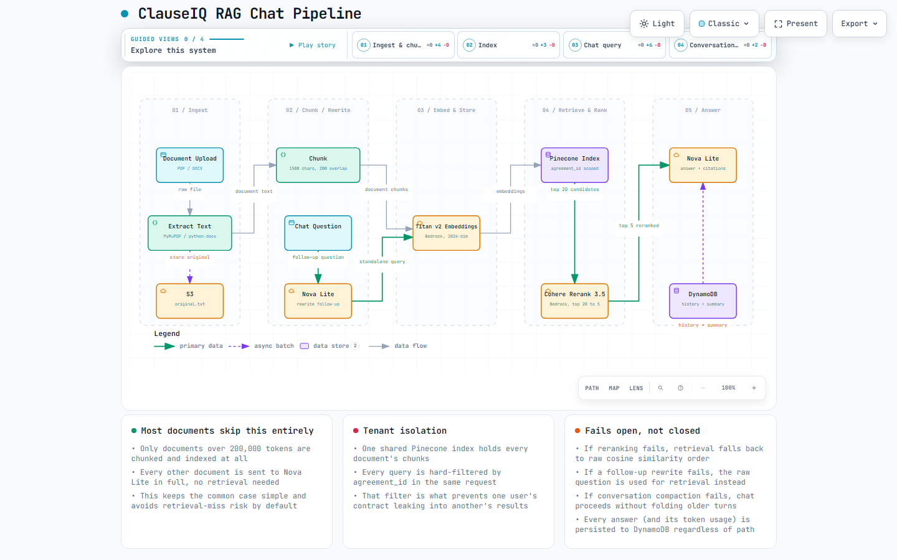

# ClauseIQ

AI-powered contract analysis and chat. Upload a legal document, get a structured risk analysis in seconds, and ask follow-up questions grounded in the actual text — with citations back to the exact section, page, and line.

## What it does

- **Analyzes contracts automatically** — verdict (sign / proceed with caution / high risk), identified risks, ambiguous clauses, a normalized checklist against standard clause types for the document's category (NDA, employment, lease, SaaS, etc.), financial terms, and key dates.
- **Answers questions about the document**, with every factual claim backed by a citation, and a hard rule against answering from outside knowledge for document-specific questions.
- **Remembers the conversation properly.** Recent turns are kept verbatim; anything older is folded into a rolling summary instead of being silently forgotten once a conversation runs long.
- **Scales to very large documents** without paying retrieval overhead on small ones — most contracts are sent to the model in full; only documents that exceed the context budget go through chunking, embedding, and retrieval at all.
- **Shares a conversation** via a public, read-only link, without exposing the source document.

## Architecture



The interactive version (pan, zoom, guided walkthroughs of each phase) is in [`clauseiq-rag-pipeline.html`](clauseiq-rag-pipeline.html) — download and open it in a browser.

**End to end:**

1. A document is uploaded, text is extracted (PyMuPDF for PDF, python-docx for Word — preserving table structure and document order), and a SHA-256 hash is checked against previously-analyzed documents to skip redundant AI calls on duplicates.
2. An S3 upload event triggers an async Lambda pipeline (dispatcher → SQS → worker) that runs the analysis through Amazon Nova Lite and writes structured results to DynamoDB.
3. Documents over the model's context budget are chunked, embedded (Amazon Titan v2), and indexed in Pinecone, isolated per document via a metadata filter on a single shared index.
4. Chat retrieval rewrites follow-up questions into standalone queries, retrieves a wide candidate pool, reranks it with Cohere Rerank 3.5, and drops anything below a relevance threshold — falling back gracefully at every step if a call fails.
5. Answers are generated by Nova Lite with the retrieved context (or the full document, for the common case), the conversation summary, and strict citation and grounding rules.

## Tech stack

| | |
|---|---|
| **Backend** | Python 3.12, FastAPI, AWS Lambda (SAM), DynamoDB, S3, SQS, Cognito |
| **AI / RAG** | Amazon Bedrock (Nova Lite, Titan v2 embeddings, Cohere Rerank 3.5), Pinecone |
| **Frontend** | React 19, TypeScript, Vite, Tailwind CSS, TanStack Query, AWS Amplify |
| **Infra** | AWS SAM / CloudFormation, GitHub Actions CI/CD |

## Testing

53 backend tests, run against `moto`-mocked AWS — including real JWT signature verification (RSA-signed test tokens, not stubbed), real DynamoDB conditional-write semantics for the rate limiter, and the full RAG retrieval and reranking flow. `pytest tests/` from the repo root.

## Project structure

```
api/           FastAPI app (Lambda) — routers, auth, RAG utilities
worker/        Async analysis pipeline (SQS-triggered Lambda)
dispatcher/    S3 → SQS handoff (Lambda)
frontend/      React SPA
tests/         Backend test suite
evals/         Offline evaluation scripts (chunking, retrieval, extraction quality)
template.yaml  AWS SAM infrastructure definition
```

## Running locally

```bash
# Backend tests
pip install -r requirements-dev.txt
pytest tests/

# Frontend
cd frontend
npm install
npm run dev
```

Deploying requires an AWS account, a Pinecone index, and a Cognito user pool — see `template.yaml` for the full resource definitions.
